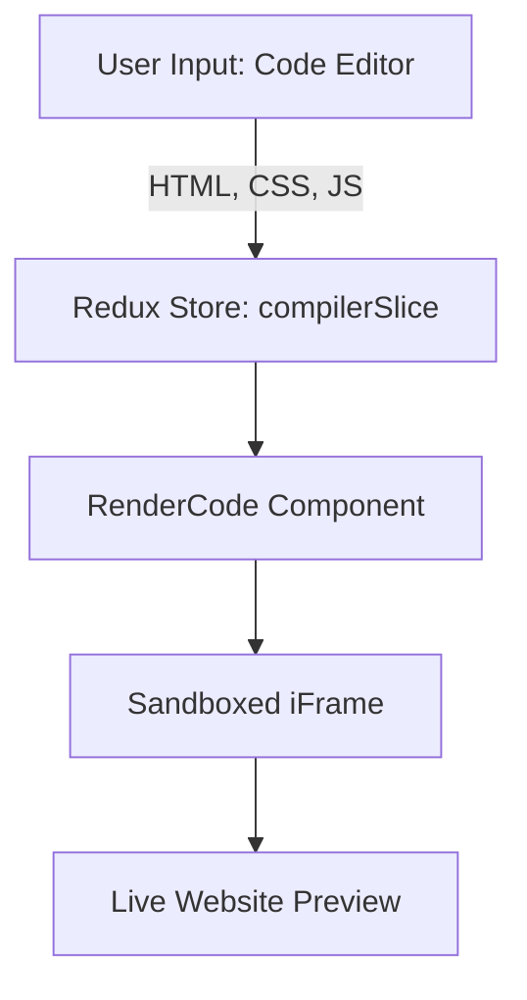

# CodePaintClient

## 📌 Overview

CodePaintClient is a lightweight **front-end development playground** where users can write **HTML, CSS, and JavaScript** on one side of the screen and instantly preview the rendered website on the other side. It mimics the behavior of platforms like **CodePen** or **JSFiddle**, making it perfect for learning, experimenting, and prototyping.

---

## 🚀 Features

* ✍️ **Code Editor** – Separate editors for HTML, CSS, and JavaScript.
* ⚡ **Live Preview** – Real-time rendering of code in a sandboxed iframe.
* 🖥 **Split-Screen Layout** – Side-by-side code editor and output view.
* 🎨 **Syntax Highlighting & Theming** (via editor components).
* 📂 **Modular Components** – Reusable UI (buttons, dialogs, loaders, etc.).
* 🌐 **Error Handling** – Graceful handling of runtime errors.
* 🗂 **State Management** – Powered by Redux for managing editor content.

---

## 🏗 Tech Stack

* **React + TypeScript** → UI framework.
* **Redux Toolkit** → State management (HTML, CSS, JS code snippets).
* **Vite** → Fast build tool.
* **Tailwind CSS** → Styling.
* **ShadCN/UI components** → Prebuilt UI primitives (buttons, dialogs, select menus, resizable panes).

---

## 🔧 Architecture & Workflow



**Flow:**

1. User writes code in the **CodeEditor**.
2. The code is stored in **Redux (compilerSlice)**.
3. **RenderCode.tsx** takes the code, injects it into an **iframe**.
4. The iframe displays the website **live** as the user types.

---

## 📂 Project Structure

```
src/
 ┣ components/        # Reusable UI + editor + preview components
 ┃ ┣ CodeEditor.tsx
 ┃ ┣ RenderCode.tsx
 ┃ ┣ Header.tsx / HelperHeader.tsx
 ┃ ┣ Loader/
 ┃ ┗ ui/ (buttons, dialogs, resizable panes, select, notifications)
 ┣ pages/             # Main views
 ┃ ┣ Compiler.tsx     # Editor + Preview page
 ┃ ┣ Home.tsx
 ┃ ┗ NotFound.tsx
 ┣ redux/             # State management
 ┃ ┣ store.ts
 ┃ ┗ slices/compilerSlice.ts
 ┣ utils/             # Helpers (error handling, misc utils)
 ┣ App.tsx            # Root component
 ┣ main.tsx           # Entry point
 ┗ index.css          # Global styles
```

---

## ⚙️ Setup & Installation

```bash
# Clone repo
git clone https://github.com/69GliTcH/CodePaintClient.git
cd CodePaintClient

# Install dependencies
npm install

# Start development server
npm run dev
```

The app runs at: [https://livecodepaint.netlify.app]

---

## ❗ Challenges & Solutions

* **Real-time performance** → Used Redux for efficient state management & isolated iframe rendering.
* **Error handling** → Added helper utilities for safe execution of user scripts.
* **Component reusability** → Built modular UI components (buttons, loaders, dialogs).

---

## 🔮 Future Enhancements

* 💾 Save/load code snippets locally or via cloud.
* 🌙 Dark/light theme toggle.
* ⚛️ Support for frameworks (React, Vue, Angular).
* 👥 Real-time collaboration (multi-user editing).
* 📤 Export projects as HTML files.

---

## 🎯 Impact & Use Cases

* Ideal for **students & beginners** learning front-end dev.
* Quick prototyping tool for **developers**.
* Personal **sandbox environment** for experimenting with code.

---

## 🗣 Interview Summary (2 min pitch)

> *"CodePaintClient is a React + TypeScript front-end playground where users can write HTML, CSS, and JavaScript with live preview. I used Redux for managing code state and rendered it inside a sandboxed iframe for real-time output. The project strengthened my understanding of state management, component design, and performance optimization in front-end apps."*
